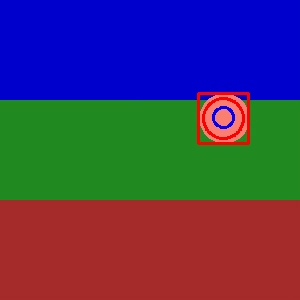
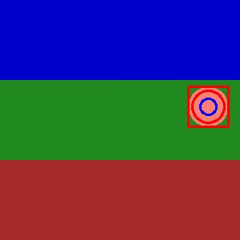

# Kalman Filter Object Tracking

This project implements object tracking using Kalman filters, based on the CS6476 Computer Vision course assignment. The implementation provides robust tracking capabilities for various objects in video sequences using both template matching and HOG-based person detection.

## Features

- Kalman Filter implementation for object tracking
- Support for both position and velocity state estimation
- Multiple detection methods:
  - Template matching for general object tracking
  - HOG-based person detection
- Configurable process and measurement noise parameters
- Real-time visualization of tracking results
- Support for saving specific frames during tracking

## Installation

This project uses `uv` as the package manager. To install dependencies:

```bash
# Create and activate virtual environment
uv venv
source .venv/bin/activate  # On Windows: .venv\Scripts\activate

# Install dependencies
uv sync
```

## Project Structure

```
.
├── src/
│   ├── kalman.py      # Kalman Filter implementation
│   └── tracker.py     # Object tracking implementation
├── main.py            # Main script for running the tracker
└── README.md          # This file
```

## Usage

### Basic Usage

```python
from src.tracker import ObjectTracker, TrackingConfig
from src.kalman import KalmanFilter

# Define template region
template_region = {
    'x': 140,  # x coordinate of top-left corner
    'y': 72,   # y coordinate of top-left corner
    'w': 50,   # width of template
    'h': 50    # height of template
}

# Process video with template matching
process_video("path/to/video.mp4", template_region, detector_type="template")
```

### Configuration Options

The tracker can be configured using the `TrackingConfig` class:

```python
config = TrackingConfig(
    noise_std_x=5.0,        # Standard deviation of x-coordinate noise
    noise_std_y=5.0,        # Standard deviation of y-coordinate noise
    process_noise=None,     # Process noise matrix (default: 0.1 * eye(4))
    measurement_noise=None, # Measurement noise matrix (default: 0.1 * eye(2))
    template_size=None,     # Template size for template matching
    detection_threshold=0.5 # Detection confidence threshold
)
```

### Detection Methods

1. **Template Matching**
   - Best for tracking specific objects
   - Requires initial template region
   - More accurate for known objects
   - Faster processing

2. **HOG-based Person Detection**
   - Specifically designed for person tracking
   - No template required
   - More robust to appearance changes
   - Slower processing

## Dependencies

- numpy: For numerical computations
- opencv-python: For image processing and computer vision tasks

## Output

The tracker provides real-time visualization showing:
- Red circle: Current measurement
- Blue circle: Kalman filter prediction
- Red rectangle: Detected object region

## Example Output

Below are real examples of output frames generated by the tracker:

| Frame 10                          | Frame 20                          |
|-----------------------------------|-----------------------------------|
|           |           |

- **Red circle:** Current measurement
- **Blue circle:** Kalman filter prediction
- **Red rectangle:** Detected object region


